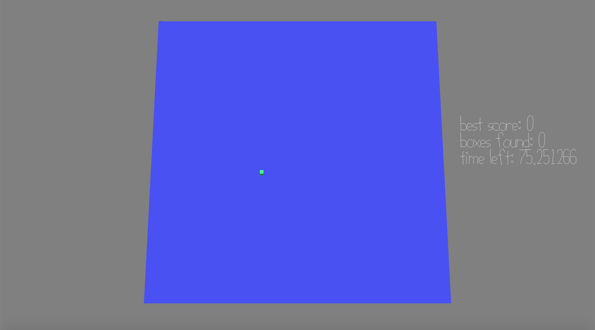

# Did you hear that?

Author: Jianrong Yu

Design: This game is about finding the source of the sound. The closer you get, the higher the volume. 
Having a surround sound headphone is important to play this game

Screen Shot:

How To Play:

You control the box using the direction keys. Imagine youself as the green box. 
Under a limited amount of time you need to find as many targets as you can. 
As soon as you find a target, the next target's sound will appear and you need to move to that spot.

It could be tricky to find the vertical position of the target. It's recommended that you move the box horizontally first,
and then try up and down to find which way gets you closer to the source.

Remember to hold the direction key. Don't click it!! Clicking is really slow. Holding it gives you an acceleration.

Sources: All sound tracks were created by myself using Waveform. The scene was created using blender.

This game was built with [NEST](NEST.md).

